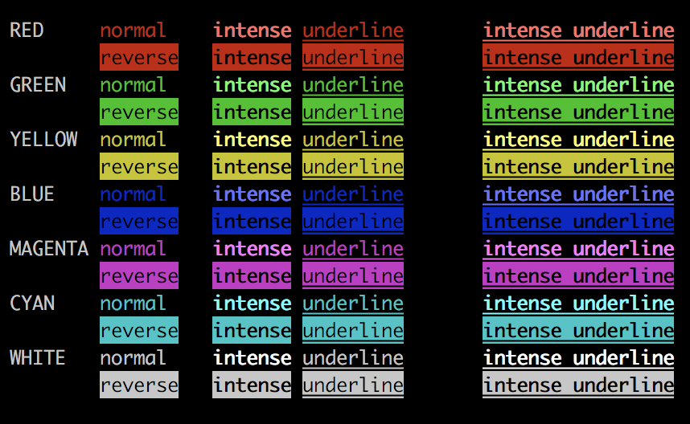

# Iris
## Serverless text-based forum for tilde-likes

Iris is a tiny bit of shared message and file convention that pretends to be forum software.

It is a fully usable message system, designed for use between different users on a single server.

Iris is strictly text-based, requiring no GUI or web servers.

 * [Installation](#installation)
 * [Usage](#usage)
 * [Commands](#commands)
 * [Command-line Options](#command-line-options)
 * [Text Features/Markup](#text-featuresmarkup)
 * [Philosophy](#philosophy)
 * [Technical Bits](#technical-bits)
 * [License](#license)

## Installation

At its core, Iris is simply a single, executable Ruby script.  It has been tested and is known to work with Ruby 2.3.5.  No extra gems or libraries are required.

Copy or symlink `iris.rb` somewhere the whole server can use it; `/usr/local/bin` is a good candidate:

```
chmod 755 ./iris.rb
mv ./iris.rb /usr/local/bin/iris
```

## Usage

Iris has a readline interface that can be used to navigate the message corpus.

### Readline Interface Example
```
%> iris
Welcome to Iris v. 1.0.5.  Type "help" for a list of commands.
jimmy_foo@ctrl-c.club> topics

 | 1 | 2018-01-24T05:49:53Z | jimmy_foo@ctrl-c.club   | Welcome!
 | 2 | 2018-01-24T16:13:05Z | jerry_berry@ctrl-c.club | Suggestions for improv...

jimmy_foo@ctrl-c.club>
```

## Commands

 * [[t]opics](#topics)
 * [Display topic](#display-topic)
 * [[c]ompose](#compose)
 * [[r]eply](#reply)
 * [[f]reshen](#freshen)
 * [reset OR clear](#reset-or-clear)
 * [[i]nfo](#info)
 * [[h]elp](#help)

---

### [t]opics
`topics, t    - List all topics`

This outputs a list of top-level topics that have been composed by everyone on the server.

```
jimmy_foo@ctrl-c.club> topics

 | 1 | 2018-01-24T05:49:53Z | jimmy_foo@ctrl-c.club   | Welcome!
 | 2 | 2018-01-24T16:13:05Z | jerry_berry@ctrl-c.club | Suggestions for improv...

```

1. The first column is the topic index.  This is the reference number to use when displaying or replying to a topic.
1. The second column is the timestamp.  This is the server-local time when the topic was composed or last replied to.
1. The third column is the author.  This is the user who composed the topic.
1. The fourth column is the title.  This is the truncated first line of the topic.

---

### Display topic
`# (topic id) - Read specified topic`

Type in the index of the topic you wish to read.  This will display the topic and all its replies.
```
jimmy_foo@ctrl-c.club> topics

 | 1 | 2018-01-24T05:49:53Z | jimmy_foo@ctrl-c.club   | Welcome!
 | 2 | 2018-01-24T16:13:05Z | jerry_berry@ctrl-c.club | Suggestions for improv...

jimmy_foo@ctrl-c.club> 1
*** On 2018-01-24T05:49:53Z, jimmy_foo@ctrl-c.club posted...
---------------------------------------------------------------------------------
Welcome!
It's good to see everyone here!
---------------------------------------------------------------------------------

  === REPLY === On 2018-01-30T22:50:38Z, jerry_berry@ctrl-c.club replied...
  | ---------------------------------------------------------------------------------
  | Thanks!
  | ---------------------------------------------------------------------------------

```

---

### [c]ompose
`compose, c    - Add a new topic`

This allows you to add a new top-level topic to the board.  The first line of your new topic will be used as the topic title.

The line editor is quite basic.  Enter your message, line-by-line, and type a single period on a line by itself to end the message.

If you post an empty message, the system will discard it.

```
jimmy_foo@ctrl-c.club~> compose
Writing a new topic.  Type a period on a line by itself to end message.

new~> How do I spoo the fleem?
new~> It's not in the docs and my boss is asking.  Any help is appreciated!
new~> .
Topic saved!


jimmy_foo@ctrl-c.club~> topics

 | 1 | 2018-01-24T05:49:53Z | jimmy_foo@ctrl-c.club   | Welcome!
 | 2 | 2018-01-24T16:13:05Z | jerry_berry@ctrl-c.club | Suggestions for improv...
 | 3 | 2018-01-23T00:13:44Z | jimmy_foo@ctrl-c.club   | How do I spoo the fleem?
```

---

### [r]eply
`reply #, r # - Reply to a specific topic`

Replies are responses to a specific topic -- they only appear when displaying the topic.

The line editor is quite basic.  Enter your message, line-by-line, and type a single period on a line by itself to end the message.

If you post an empty message, the system will discard it.

```
jennie_minnie@ctrl-c.club~> reply 3
Writing a reply to topic 'How do I spoo the fleem?'.  Type a period on a line by itself to end message.

reply~> Simple, you just boondoggle the flibbertigibbet.  That should be in the manual.
reply~> .
Reply saved!

jennie_minnie@ctrl-c.club~> 3

*** On 2018-01-23T00:13:44Z, jimmy_foo@ctrl-c.club posted...
---------------------------------------------------------------------------------
How do I spoo the fleem?
It's not in the docs and my boss is asking.  Any help is appreciated!
---------------------------------------------------------------------------------

  === REPLY === On 2018-01-31T05:59:27Z, jennie_minnie@ctrl-c.club replied...
  | ---------------------------------------------------------------------------------
  | Simple, you just boondoggle the flibbertigibbet.  That should be in the manual.
  | ---------------------------------------------------------------------------------
```

---

### [f]reshen
`freshen, f   - Reload to get any new messages`

This command reloads all users' message files to get any new messages that might have come in since you started the program.

---

### reset OR clear
`reset, clear - Fix screen in case of text corruption`

This clears the screen and resets the cursor. If you experience screen corruption due to wide characters or terminal resizing, this may fix your visual issues.

---

### [i]nfo
`info, i      - Display Iris version and message stats`

This outputs the current version of Iris, along with messsage, topic, and author counts.

```
jennie_minnie@ctrl-c.club~> info

Iris 1.0.5
13 topics, 0 unread.
50 messages, 0 unread.
10 authors.
```

---

### [h]elp
`help, h, ?   - Display this text`

This displays helpful reminders of the commands that Iris supports.

## Command-line Options

There are a few options you can pass in from the command-line:

 * [--version, -v](#--version-v)
 * [--stats, -s](#--stats-s)
 * [--interactive, -i](#--interactive-i)
 * [--dump, -d](#--dump-d)
 * [--help, -h](#--help-h)

### --version/-v

This displays the current version of Iris and exits.

```
iris --version
```

```
Iris 1.0.5
```

---

### --stats/-s

This outputs the current version of Iris, along with messsage, topic, and author counts.

This command does not enter Iris' interactive mode.

```
iris --stats
```

```
Iris 1.0.5
13 topics, 0 unread.
50 messages, 0 unread.
10 authors.
```

---

### --interactive/-i

This command enters Iris' interactive mode, the default mode with which users can compose and read topics and replies.

This is the mode that Iris enters if no options are passed on the command-line.

---

### --dump/-d

This reads the entire message corpus and outputs it as a stream of JSON data, suitable for piping into a backup file, `jq` parser, or similar.

This command does not enter Iris' interactive mode.

---

### --help/-h

This command displays a complete list of options that Iris recognizes.

## Text Features/Markup

### Color

Iris supports 7 colors and 4 text features.

#### Colors

| Marker | Color   |
|:------:|:--------|
| r      | Red     |
| g      | Green   |
| y      | Yellow  |
| b      | Blue    |
| m      | Magenta |
| c      | Cyan    |
| w      | White   |

#### Text Features

| Marker | Feature    |
|:------:|:-----------|
| n      | Normal     |
| i      | Intense    |
| u      | Underlined |
| v      | Reversed   |

#### Markup

Colors and Text Features are applied by a simple markup.  Surround the text you want colored with an opening curly brace (`{`), add some number of text modification markers (`riu`, for example),  and `}`), and close with a closing curly brace (`}`).

For example, if you have the text:

```
The blue fox and the yellow dog
```

...and you wanted to color it appropriately, you would wrap the text "blue fox" and "yellow dog" like so:

```
The {b blue fox} and the {y yellow dog}
```

The result, in your final message, would look like:


---

Text features can be added as well:

```
The {b blue fox} {u will} jump over the {y yellow dog}
```


---

A color can be combined with multiple text features:

```
The {b blue fox} {riuv will} jump over the {y yellow dog}
```


---

Marker order does not matter.  These two statements are equivalent:

```
The {bv blue fox} {riuv will} jump over the {yi yellow dog}
The {vb blue fox} {uirv will} jump over the {iy yellow dog}
```

---

If you want to type a curly brace, preface it with a backslash (`\`):

```
No colors for me, please.  I just want to \{ write: code \}
```

...yields:

```
No colors for me, please.  I just want to { write: code }
```

---

#### Color and Text Feature Sample



---

#### Caveats

Color and text feature markup cannot be nested.  It won't break anything, but it will probably not look like you are expecting.

## Philosophy

Iris must:
  * Be a single file
    * There should be no required directory structure or complicated setup.
    * Run a single file, answer one question, and you should be going with Iris!
  * Not require administrator intervention to install
    * Any user on a tilde, or with his or her own server, should be able to start using Iris just by running the file.
  * Not require any other software to function
    * No databases, web servers, GUIs, or frameworks are require to use Iris fully.
  * Require only Ruby
    * Not everybody uses Ruby or is familiar with the Ruby ecosystem.
    * Installing gems and libraries can be a major hassle if you don't have admin access or if there are library version conflicts.
    * Iris needs no extra gems or libraries to function.
  * Be durable
    * A user deleting or modifying his or her messages or message file should not break Iris.
    * Deleted or edited messages should leave flags or placeholders for other users to know that other content was there before.
    * The Iris client should expect that any message file could be missing, altered, or corrupted, and should handle those cases gracefully.
  * Be portable
    * All Iris files should be human-readable (and -editable, in a pinch)
    * The use of the official Iris client should be optional for a user to manage his or her messages.  A text editor should suffice.
    * Other clients which follow the Iris file format should work seamlessly with the official Iris client.
  * Be secure
    * Message files should be owned and only editable by their author.
    * Iris should warn the user if this is not the case.

## Technical Bits

  * [Conventions](#conventions)
  * [Message Files](#message-files)
  * [Messages](#messages)
    * [Message Hash](#message-hash)
      * [Bad Hashes](#bad-hashes)
    * [Edit Chain](#edit-chain)
    * [Deleted Messages](#deleted-messages)
  * [Topic List](#topic-list)
  * [Replies](#replies)

### Conventions

Iris leans heavily on convention.  Iris' security and message authentication is provided by filesystem permissions and message hashing.

### Message Files

Each user has their own message file.  This is a JSON file containing all the messages that the user has authored.  It is named `.iris.messages` and is located in the user's home directory.

`/home/jimmy_foo/.iris.messages`

In order to operate correctly and safely, this file _must_ be:
* World-readable
* Owner-writable
* Non-executable
* Owned by the user account that will be storing messages for

```
%> ls -la ~/.iris.messages
-rw-r--r-- 1 jimmy_foo jimmy_foo /home/jimmy_foo/.iris.messages
```

### Messages
#### Message Hash
##### Bad Hashes
#### Edit Chain
#### Deleted Messages

### Topic List

###Replies

## License
GPLv2
